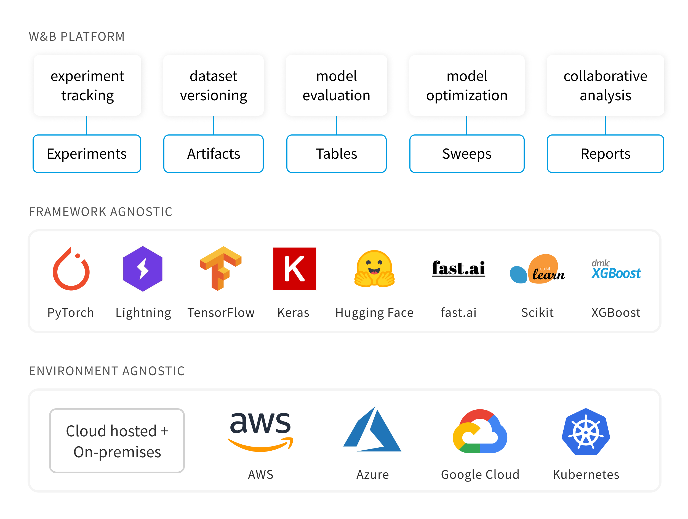

# Welcome to the Weights and Biases Demo using MkDocs

!!! note

    This is an demo of what the Weights and Biases developer guide could look like if we use MkDocs.

Weights & Biases is the machine learning platform for developers to build better models faster. Use W&B's lightweight, interoperable tools to quickly track experiments, version and iterate on datasets, evaluate model performance, reproduce models, visualize results and spot regressions, and share findings with colleagues.
Set up W&B in 5 minutes, then quickly iterate on your machine learning pipeline with the confidence that your datasets and models are tracked and versioned in a reliable system of record.

For full documentation visit [mkdocs.org](https://www.mkdocs.org).
For a tutorial on how to create an API Reference guide using docstrings, see this awesome tutorial on the Real Python's webiste [Build Your Python Project Documentation with MkDocs](https://realpython.com/python-project-documentation-with-mkdocs/#demo). For a sample developer guide that has cool examples of what can be done using MkDocs, see the [Material for MkDocs developer guide](https://squidfunk.github.io/mkdocs-material/getting-started/). 

## Guides
1. [Experiment Tracking](https://docs.wandb.ai/guides/track)
2. [Hyperparameter Tuning](https://docs.wandb.ai/guides/sweeps)
3. [Data and Model Versioning](https://docs.wandb.ai/guides/artifacts)
4. [Manage Models](https://docs.wandb.ai/guides/models)

